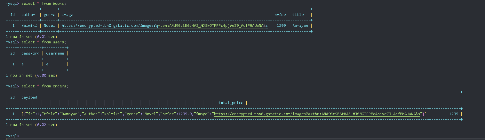

# WT LAB Assignment 5: Book Store App 

___
```
Name : Aditya Sakhare

Roll No: 26 TYCS-D Batch 2  
```

### Design: 


### Tables:

```bash
mysql> select * from books;
+----+---------+-------+----------------------------------------------------------------------------------------------+-------+---------+
| id | author  | genre | image                                                                                        | price | title   |
+----+---------+-------+----------------------------------------------------------------------------------------------+-------+---------+
|  1 | Walmiki | Novel | https://encrypted-tbn0.gstatic.com/images?q=tbn:ANd9GcSB6tHAS_MJGNOTPPFc4pjVeZ9_AcfFMAUaNA&s |  1299 | Ramayan |
+----+---------+-------+----------------------------------------------------------------------------------------------+-------+---------+
1 row in set (0.01 sec)
mysql> select * from users;
+----+----------+----------+
| id | password | username |
+----+----------+----------+
|  1 | a        | a        |
+----+----------+----------+
1 row in set (0.00 sec)

mysql> select * from orders;
+----+---------------------------------------------------------------------------------------------------------------------------------------------------------------------------------------+-------------+
| id | payload                                                                                  
                                                                                             | total_price |
+----+---------------------------------------------------------------------------------------------------------------------------------------------------------------------------------------+-------------+
|  1 | [{"id":1,"title":"Ramayan","author":"Walmiki","genre":"Novel","price":1299.0,"image":"https://encrypted-tbn0.gstatic.com/images?q=tbn:ANd9GcSB6tHAS_MJGNOTPPFc4pjVeZ9_AcfFMAUaNA&s"}] |        1299 |
+----+---------------------------------------------------------------------------------------------------------------------------------------------------------------------------------------+-------------+
1 row in set (0.02 sec)

mysql>

```

## Screenshots:




## Codes:

### Frontend (React + Vite):

## ```src/App.jsx```
```jsx
import React from 'react';
import { BrowserRouter as Router, Route, Routes } from 'react-router-dom';
import HomePage from './components/HomePage';
import LoginPage from './components/LoginPage';
import CataloguePage from './components/CataloguePage';
import RegistrationPage from './components/RegistrationPage';
import 'bootstrap/dist/css/bootstrap.min.css';
import './style.css'
import CartPage from './components/CartPage';
function App() {
  return (
    <Router>
      <Routes>
        <Route path="/" exact element={ <HomePage/> } />
        <Route path="/login" element={<LoginPage/>} />
        <Route path="/catalogue" element={<CataloguePage/>} />
        <Route path="/register" element={<RegistrationPage/>} />
        <Route path='/cart' element={<CartPage />} />
      </Routes>
    </Router>
  );
}

export default App;
```


____
## ```src/componenets/```

```jsx
// src/components/HomePage.jsx
import React from 'react';
import { Link } from 'react-router-dom';  // Link for navigation
import 'bootstrap/dist/css/bootstrap.min.css';  // Make sure Bootstrap is imported

function HomePage() {
  return (
    <div className="main-container">
      {/* Main Content */}
      <div className="content">
        <section className="hero hero-bg text-white text-center py-5">
          <div className="container">
            <h1 className="display-4 main-heading ">Welcome to Our Online Bookstore</h1>
            <p className="lead mb-4">Explore a wide variety of books, from fiction to non-fiction, and everything in between.</p>
            <div className="container ">
              <Link to="/catalogue" className="btn btn-light btn-lg mx-2">Browse Books</Link>
              <Link to="/login" className="btn btn-light btn-lg mx-2">Login</Link>
            <Link to="/register" className="btn btn-light btn-lg mx-2">Register</Link>
            </div>
          </div>
        </section>

        {/* More content goes here */}
      </div>

      {/* Footer */}
      <footer className="bg-dark text-white text-center py-4">
        <div className="container">
          <p>&copy; Created by Aditya Sakhare</p>
        </div>
      </footer>
    </div>
  
  );
}

export default HomePage;

```

```jsx
// src/pages/CartPage.jsx
import React, { useState, useEffect } from 'react';
import { useNavigate } from 'react-router-dom';
import axios from 'axios';

function CartPage() {
  const [cart, setCart] = useState([]);
  const [total, setTotal] = useState(0);
  const navigate = useNavigate();

  // Get cart from local storage (optional)
  useEffect(() => {
    const savedCart = JSON.parse(localStorage.getItem('cart')) || [];
    setCart(savedCart);
    calculateTotal(savedCart);
  }, []);

  // Update total price
  const calculateTotal = (cartItems) => {
    let totalPrice = 0;
    cartItems.forEach(item => {
      totalPrice += item.price;
    });
    setTotal(totalPrice);
  };

  // Remove item from cart
  const removeItem = (id) => {
    const updatedCart = cart.filter(item => item.id !== id);
    setCart(updatedCart);
    localStorage.setItem('cart', JSON.stringify(updatedCart)); // Save to local storage
    calculateTotal(updatedCart);
  };

  // Place Order
  const placeOrder = () => {
    const order = {
      items: cart,
      totalPrice: total,
    };
    axios.post('http://localhost:8080/api/order', order)
      .then(response => {
        // Handle order success, clear cart
        alert('Order placed successfully!');
        setCart([]);
        localStorage.removeItem('cart');
        navigate('/catalogue');  // Redirect to catalogue
      })
      .catch(error => {
        console.error('Error placing order', error);
        alert('Failed to place order');
      });
  };

  return (
    <div className="container py-5">
      <h2 className="text-center">Your Cart</h2>
      <div className="row">
        {cart.length === 0 ? (
          <p>Your cart is empty.</p>
        ) : (
          cart.map(item => (
            <div className="col-md-4" key={item.id}>
              <div className="card mb-4">
                
                <div className="card-body">
                  <h5 className="card-title">{item.title}</h5>
                  <p className="card-text">Price: Rs.{item.price}</p>
                  <button className="btn btn-danger" onClick={() => removeItem(item.id)}>Remove</button>
                </div>
              </div>
            </div>
          ))
        )}
      </div>
      <div className="text-center">
        <h3>Total: Rs.{total}</h3>
        <button className="btn btn-success" onClick={placeOrder}>Place Order</button>
      </div>
    </div>
  );
}

export default CartPage;

```

```jsx
import React, { useState, useEffect } from 'react';
import { Link } from 'react-router-dom';
import axios from 'axios';

function CataloguePage() {
  // State to store the form inputs
  const [title, setTitle] = useState('');
  const [author, setAuthor] = useState('');
  const [genre, setGenre] = useState('');
  const [price, setPrice] = useState('');
    const [image, setImage] = useState('');
  
  // State to store the book list
  const [books, setBooks] = useState([]);

  // Fetch books on page load
  useEffect(() => {
    axios.get('http://localhost:8080/api/books')  // Replace with your backend API
      .then(response => {
        setBooks(response.data);
      })
      .catch(error => {
        console.error('Error fetching books', error);
      });
  }, []);

  // Handle form submission to add a new book
  const handleAddBook = (e) => {
    e.preventDefault();
    
    const newBook = {
      title,
      author,
      genre,
      price,
      image: "https://encrypted-tbn0.gstatic.com/images?q=tbn:ANd9GcSB6tHAS_MJGNOTPPFc4pjVeZ9_AcfFMAUaNA&s",
    };

    axios.post('http://localhost:8080/api/books', newBook)  // Replace with your backend API
      .then(response => {
        // On success, clear form and fetch updated book list
        setTitle('');
        setAuthor('');
        setGenre('');
        setPrice('');
        setImage('');
        alert('Book added successfully!');
        setBooks([...books, response.data]);  // Add new book to the list
      })
      .catch(error => {
        console.error('Error adding book', error);
        alert('Error adding book!');
      });
  };


  const addToCart = (book) => {
    const cart = JSON.parse(localStorage.getItem('cart')) || [];
    cart.push(book);
    alert('Book added to cart!');
    localStorage.setItem('cart', JSON.stringify(cart));
  };

  return (
    <div className="container">
        <h1>Book Store</h1>
        <div className="d-flex justify-content-between align-items-center my-4">
  <h2 className="me-3">Catalogue</h2> {/* Add margin to the right for spacing */}
  <Link to="/cart" className="btn btn-secondary w-50">Go to Cart</Link>
</div>

      
      {/* Add Book Form */}
      <div className="card my-4">
        <div className="card-body">
          <h3>Add New Book</h3>
          <form onSubmit={handleAddBook}>
            <div className="mb-3">
              <label htmlFor="title" className="form-label">Title</label>
              <input
                type="text"
                id="title"
                className="form-control"
                value={title}
                onChange={(e) => setTitle(e.target.value)}
                required
              />
            </div>

            <div className="mb-3">
              <label htmlFor="author" className="form-label">Author</label>
              <input
                type="text"
                id="author"
                className="form-control"
                value={author}
                onChange={(e) => setAuthor(e.target.value)}
                required
              />
            </div>

            <div className="mb-3">
              <label htmlFor="genre" className="form-label">Genre</label>
              <input
                type="text"
                id="genre"
                className="form-control"
                value={genre}
                onChange={(e) => setGenre(e.target.value)}
                required
              />
            </div>

            <div className="mb-3">
              <label htmlFor="price" className="form-label">Price</label>
              <input
                type="number"
                id="price"
                className="form-control"
                value={price}
                onChange={(e) => setPrice(e.target.value)}
                required
              />
            </div>
            <div className="mb-3">
              <label htmlFor="image" className="form-label">Image URL</label>
              <input
                type="text"
                id="image"
                className="form-control"
                value={image}
                onChange={(e) => setImage(e.target.value)}
                required
              />
            </div>

            <button type="submit" className="btn btn-primary">Add Book</button>
          </form>
        </div>
      </div>

      {/* List of Books */}
      <div className="container py-5">
      <h2 className="text-center">Available Books   </h2>
      
      <div className="row">
        {books.map((book) => (
          <div className="col-md-4" key={book.id}>
            <div className="card mb-4">
              
              <div className="card-body">
                <h5 className="card-title">{book.title}</h5>
                <p className="card-text">Author: {book.author}</p>
                <p className="card-text">Price: Rs.{book.price}</p>
                <button className="btn btn-primary" onClick={() => addToCart(book)}>
                  Add to Cart
                </button>
              </div>
            </div>
          </div>
        ))}
      </div>
     
    </div>
    </div>
  );
}

export default CataloguePage;

```

```jsx
// src/components/LoginPage.jsx
import React, { useState } from 'react';
import API from '../api/api';  // Import the custom API service
import { useNavigate } from 'react-router-dom';  // Import useNavigate for navigation
import 'bootstrap/dist/css/bootstrap.min.css';  // Make sure Bootstrap is imported

function LoginPage() {
  const [username, setUsername] = useState('');
  const [password, setPassword] = useState('');
  const navigate = useNavigate();  // Using useNavigate instead of useHistory

  const handleSubmit = (e) => {
    e.preventDefault();
  
    API.post('login', { username, password })
      .then(response => {
        alert(response.data); // Login successful
        navigate('/catalogue');
      })
      .catch(error => {
        console.error('Login failed:', error.response?.data || error.message);
        alert('Invalid credentials. Please try again.');
      });
  };

  return (
    <div className="container d-flex justify-content-center align-items-center" style={{ height: '100vh' }}>
      <div className="card" style={{ width: '30rem' }}>
        <div className="card-body">
          <h2 className="card-title text-center mb-4">Login</h2>
          <form onSubmit={handleSubmit}>
            <div className="mb-3">
              <label htmlFor="username" className="form-label">Username</label>
              <input
                type="text"
                className="form-control"
                id="username"
                placeholder="Enter username"
                value={username}
                onChange={(e) => setUsername(e.target.value)}
              />
            </div>
            <div className="mb-3">
              <label htmlFor="password" className="form-label">Password</label>
              <input
                type="password"
                className="form-control"
                id="password"
                placeholder="Enter password"
                value={password}
                onChange={(e) => setPassword(e.target.value)}
              />
            </div>
            <button type="submit" className="btn btn-primary w-100">Login</button>
          </form>
          <div className="text-center mt-3">
            <p>Don't have an account? <a href="/register">Register here</a></p>
          </div>
        </div>
      </div>
    </div>
  );
}

export default LoginPage;


```


```jsx

// src/components/RegistrationPage.jsx
import React, { useState } from 'react';
import API from '../api/api';  // Import the custom API service
import { useNavigate } from 'react-router-dom';  // Import useNavigate for navigation
import 'bootstrap/dist/css/bootstrap.min.css';  // Make sure Bootstrap is imported

function RegistrationPage() {
  const [username, setUsername] = useState('');
  const [email, setEmail] = useState('');
  const [password, setPassword] = useState('');
  const navigate = useNavigate();  // Using useNavigate instead of useHistory

  const handleSubmit = (e) => {
    e.preventDefault();
    // Sending registration data to the backend
    API.post('register', { username, email, password })  // API call to register the user
      .then(response => {
        alert('Registration successful!');
        navigate('/login');  // Navigate to the login page after successful registration
      })
      .catch(error => {
        console.error('Registration failed:', error);
        alert('Error during registration. Please try again.');
      });
  };

  return (
    <div className="container d-flex justify-content-center align-items-center" style={{ height: '100vh' }}>
      <div className="card" style={{ width: '30rem' }}>
        <div className="card-body">
          <h2 className="card-title text-center mb-4">Register</h2>
          <form onSubmit={handleSubmit}>
            <div className="mb-3">
              <label htmlFor="username" className="form-label">Username</label>
              <input
                type="text"
                className="form-control"
                id="username"
                placeholder="Enter username"
                value={username}
                onChange={(e) => setUsername(e.target.value)}
              />
            </div>
            <div className="mb-3">
              <label htmlFor="email" className="form-label">Email</label>
              <input
                type="email"
                className="form-control"
                id="email"
                placeholder="Enter email"
                value={email}
                onChange={(e) => setEmail(e.target.value)}
              />
            </div>
            <div className="mb-3">
              <label htmlFor="password" className="form-label">Password</label>
              <input
                type="password"
                className="form-control"
                id="password"
                placeholder="Enter password"
                value={password}
                onChange={(e) => setPassword(e.target.value)}
              />
            </div>
            <button type="submit" className="btn btn-primary w-100">Register</button>
          </form>
          <div className="text-center mt-3">
            <p>Already have an account? <a href="/login">Login here</a></p>
          </div>
        </div>
      </div>
    </div>
  );
}

export default RegistrationPage;

```

## ```src/api/```

```jsx
import axios from 'axios';

const API_URL = axios.create({
    baseURL: 'http://localhost:8080/api'
});


export default API_URL;

```

____
### Backend:

## ```backend\backend\src\main\java\com\result\backend\config```

```jsx
package com.result.backend.config;

import org.springframework.context.annotation.Bean;
import org.springframework.context.annotation.Configuration;
import org.springframework.web.servlet.config.annotation.CorsRegistry;
import org.springframework.web.servlet.config.annotation.WebMvcConfigurer;

@Configuration
public class WebConfig implements WebMvcConfigurer {
    @Override
    public void addCorsMappings(CorsRegistry registry) {
        // Allow all origins, methods, and headers
        registry.addMapping("/**")
                .allowedOrigins("*")  // Allow all origins
                .allowedMethods("*")  // Allow all HTTP methods
                .allowedHeaders("*");  // Allow all headers
    }
}


```

## ```backend\backend\src\main\java\com\result\backend\controller```


```jsx
package com.book.backend.controller;


import com.book.backend.model.User;
import com.book.backend.repository.UserRepository;
import org.springframework.beans.factory.annotation.Autowired;
import org.springframework.http.HttpStatus;
import org.springframework.http.ResponseEntity;
import org.springframework.web.bind.annotation.*;

@RestController
@RequestMapping("/api")
public class AuthController {

    @Autowired
    private UserRepository userRepository;

    @PostMapping("/register")
    public String register(@RequestBody User user) {
        if (userRepository.findByUsername(user.getUsername()) != null) {
            return "Username already exists";
        }
        userRepository.save(user);
        return "Registration successful";
    }

    @PostMapping("/login")
    public ResponseEntity<String> login(@RequestBody User user) {
        User existingUser = userRepository.findByUsername(user.getUsername());
        if (existingUser != null && existingUser.getPassword().equals(user.getPassword())) {
            return ResponseEntity.ok("Login successful");
        }
        return ResponseEntity.status(HttpStatus.UNAUTHORIZED).body("Invalid username or password");
    }

}
 

```

```jsx
package com.book.backend.controller;


import com.book.backend.model.Book;
import com.book.backend.repository.BookRepository;
import org.springframework.beans.factory.annotation.Autowired;
import org.springframework.web.bind.annotation.*;

import java.util.List;

@RestController
@RequestMapping("/api/books")
public class BookController {

    @Autowired
    private BookRepository bookRepository;

    @GetMapping
    public List<Book> getAllBooks() {
        return bookRepository.findAll();
    }

    @PostMapping
    public Book addBook(@RequestBody Book book) {
        return bookRepository.save(book);
    }
}


```


```jsx        
package com.book.backend.controller;

import com.book.backend.model.Orders;
import com.book.backend.service.OrdersService;
import com.fasterxml.jackson.databind.ObjectMapper;

import org.springframework.beans.factory.annotation.Autowired;
import org.springframework.web.bind.annotation.*;

@RestController
@RequestMapping("/api/order")
public class OrdersController {

    @Autowired
    private OrdersService ordersService;

    @PostMapping
public Orders createOrder(@RequestBody Orders order) {
    try {
        ObjectMapper objectMapper = new ObjectMapper();
        String payloadString = objectMapper.writeValueAsString(order.getItems());
        order.setPayload(payloadString);  // Set the payload as a string
    } catch (Exception e) {
        e.printStackTrace();
    }
    return ordersService.saveOrder(order);
}

}
```


## ```backend\backend\src\main\java\com\result\backend\model```

```jsx
package com.book.backend.model;

import jakarta.persistence.*;

@Entity
@Table(name = "books")
public class Book {

    @Id
    @GeneratedValue(strategy = GenerationType.IDENTITY)
    private Long id;

    private String title;
    private String author;
    private String genre;
    private Double price;
    private String image;

    // Getter and Setter methods

    public Long getId() {
        return id;
    }

    public void setId(Long id) {
        this.id = id;
    }

    public String getTitle() {
        return title;
    }

    public void setTitle(String title) {
        this.title = title;
    }

    public String getAuthor() {
        return author;
    }

    public void setAuthor(String author) {
        this.author = author;
    }

    public String getGenre() {
        return genre;
    }

    public void setGenre(String genre) {
        this.genre = genre;
    }

    public Double getPrice() {
        return price;
    }

    public void setPrice(Double price) {
        this.price = price;
    }

    public String getImage() {
        return image;
    }
    public void setImage(String image) {
        this.image = image;
    }
}

```


```jsx
package com.book.backend.model;

public class BookInfo {

    private String title;
    private double price;

    public BookInfo(String title, double price) {
        this.title = title;
        this.price = price;
    }

    // Getters and Setters
    public String getTitle() { return title; }
    public void setTitle(String title) { this.title = title; }
    public double getPrice() { return price; }
    public void setPrice(double price) { this.price = price; }
}


```

```jsx

package com.book.backend.model;

import jakarta.persistence.*;
import java.util.List;

@Entity
public class Orders {

    @Id
    @GeneratedValue(strategy = GenerationType.IDENTITY)
    private Long id;

    private double totalPrice;

    // Items as a list of Book objects
    @Transient // Mark it as transient to avoid persistence (we'll use it for serialization only)
    private List<Book> items;

    @Lob  // This will store large data like JSON as a string
    private String payload;  // The serialized payload as a string

    public Orders() {}

    public Orders(double totalPrice, List<Book> items) {
        this.totalPrice = totalPrice;
        this.items = items;
    }

    // Getters and Setters
    public Long getId() { return id; }
    public void setId(Long id) { this.id = id; }
    public double getTotalPrice() { return totalPrice; }
    public void setTotalPrice(double totalPrice) { this.totalPrice = totalPrice; }
    public List<Book> getItems() { return items; }
    public void setItems(List<Book> items) { this.items = items; }
    public String getPayload() { return payload; }
    public void setPayload(String payload) { this.payload = payload; }
}


```


```jsx
package com.book.backend.model;

import jakarta.persistence.*;

@Entity
@Table(name = "users")
public class User {

    @Id
    @GeneratedValue(strategy = GenerationType.IDENTITY)
    private Long id;

    private String username;
    private String password;

    // Getter and Setter methods

    public Long getId() {
        return id;
    }

    public void setId(Long id) {
        this.id = id;
    }

    public String getUsername() {
        return username;
    }

    public void setUsername(String username) {
        this.username = username;
    }

    public String getPassword() {
        return password;
    }

    public void setPassword(String password) {
        this.password = password;
    }
}


```


## ```backend\backend\src\main\java\com\result\backend\repository```

```jsx
package com.book.backend.repository;


import com.book.backend.model.Book;
import org.springframework.data.jpa.repository.JpaRepository;

public interface BookRepository extends JpaRepository<Book, Long> {
}


```


```jsx
package com.book.backend.repository;

import com.book.backend.model.Orders;
import org.springframework.data.jpa.repository.JpaRepository;

public interface OrdersRepository extends JpaRepository<Orders, Long> {
    // Custom query methods can be added if needed
}

```

```jsx
package com.book.backend.repository;


import com.book.backend.model.User;
import org.springframework.data.jpa.repository.JpaRepository;

public interface UserRepository extends JpaRepository<User, Long> {
    User findByUsername(String username);
}
 

```

## ```backend\backend\src\main\java\com\result\backend\service```

```jsx
package com.book.backend.service;

import com.book.backend.model.Orders;
import com.book.backend.repository.OrdersRepository;
import org.springframework.beans.factory.annotation.Autowired;
import org.springframework.stereotype.Service;

@Service
public class OrdersService {

    @Autowired
    private OrdersRepository orderRepository;

    public Orders saveOrder(Orders order) {
        return orderRepository.save(order);
    }
}

```
